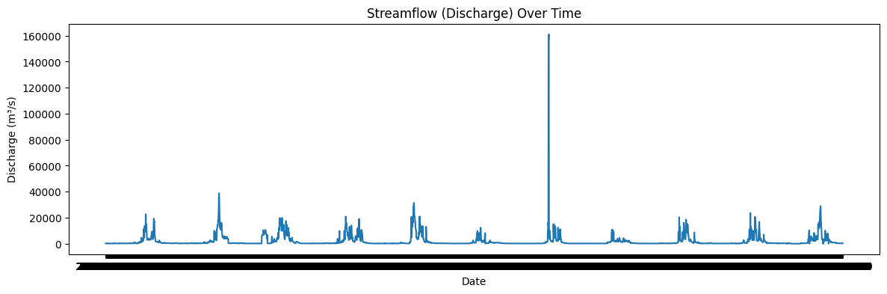
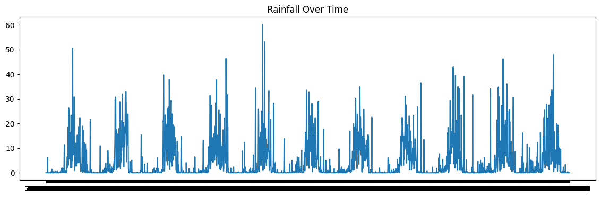
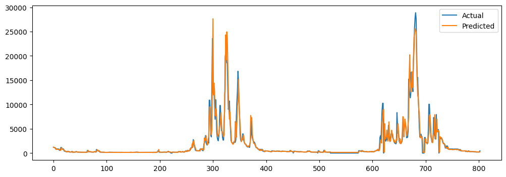
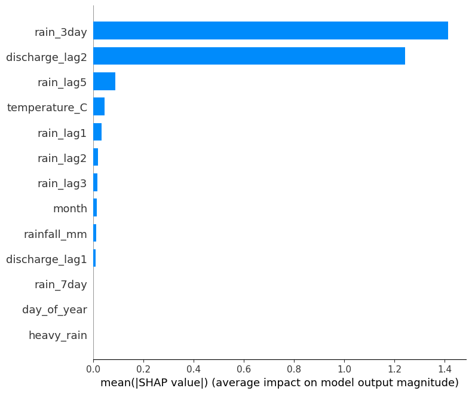
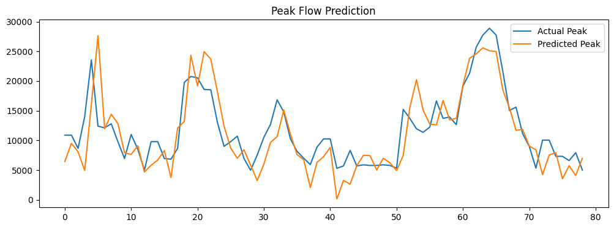

# Daily Streamflow Prediction in the Mahanadi River Basin using Machine Learning & Deep Learning

## Overview

Accurate streamflow forecasting plays a critical role in flood management, reservoir operations, water resource planning, and disaster mitigation.

This project develops and compares multiple data-driven approaches for **daily streamflow prediction** in the **Mahanadi River Basin (India)** using meteorological and hydrological observations.

The study investigates an important question:

> Does increasing model complexity always improve streamflow prediction performance?

To answer this, four different modeling approaches were developed and evaluated:

*  Random Forest
*  LightGBM
*  LSTM (Long Short-Term Memory)
*  Transformer-based Model

The project demonstrates that **feature engineering and hydrological understanding can be more important than model complexity**, especially when working with moderate-sized datasets.

---

## Study Area

### Mahanadi River Basin

The Mahanadi River Basin is one of the major river systems in eastern India and exhibits strong seasonal variability driven by monsoon rainfall.

Characteristics:

* Highly seasonal discharge patterns
* Strong dependence on antecedent rainfall
* Nonlinear rainfall-runoff relationships
* Frequent extreme flow events during monsoon months

### Observation Station

**Naraj Gauging Station**

The Naraj station was selected because it captures basin-scale downstream hydrological behavior and provides a consistent streamflow record suitable for forecasting.

---

## Data Sources

### Meteorological Data

ERA5 Reanalysis Dataset

Source:
https://cds.climate.copernicus.eu/

Variables used:

* Daily Rainfall (mm)
* Daily Temperature (°C)

### Hydrological Data

National Water Informatics Centre (NWIC)

Source:
https://indiawris.gov.in/

Variables used:

* Daily Streamflow / Discharge (m³/s)

### Time Period

2010 – 2020

---

## Data Preprocessing

The raw datasets required multiple preprocessing steps before modeling:

* Temporal aggregation of ERA5 weather data
* Alignment of weather and discharge observations
* Missing date correction
* Daily rainfall accumulation
* Daily temperature averaging
* Dataset consistency checks

A mismatch between meteorological and hydrological records was identified and resolved through date-based alignment.

---

## Feature Engineering

A major contribution of this project is the incorporation of **hydrological domain knowledge** into the machine learning pipeline.

### Engineered Features

#### Lagged Streamflow Features

* Discharge(t−1)
* Discharge(t−2)

These features capture persistence effects and delayed basin response.

#### Rainfall Accumulation Features

* 3-Day Cumulative Rainfall
* 7-Day Cumulative Rainfall

These variables represent antecedent moisture conditions and runoff generation processes.

#### Extreme Event Indicators

* Heavy rainfall flag
* Peak-flow related indicators

The results show that these engineered features contributed more to performance improvements than increasing model complexity.

---

## Modeling Pipeline

```text
ERA5 Weather Data + Streamflow Records
                    │
                    ▼
          Data Preprocessing
                    │
                    ▼
          Feature Engineering
                    │
        ┌───────────┼───────────┐
        ▼           ▼           ▼
 Random Forest   LightGBM     LSTM
                    │
                    ▼
             Transformer
                    │
                    ▼
             Model Evaluation
                    │
                    ▼
            SHAP Interpretation
```

---

## Models Evaluated

### Random Forest

* 200 Trees
* Maximum Depth = 10
* Ensemble Learning

### LightGBM

* Gradient Boosting Framework
* Histogram-Based Tree Splitting
* Optimized for Fast Training

### LSTM

* Sequential Learning Architecture
* 7-Day Sliding Window Input
* Adam Optimizer

### Transformer

* Multi-Head Self Attention
* 4 Attention Heads
* Hidden Dimension = 32

---

## Model Performance

| Model         | RMSE    | NSE   |
| ------------- | ------- | ----- |
| Random Forest | 1352.49 | 0.878 |
| LightGBM      | 1569.79 | 0.836 |
| LSTM          | 1930.88 | 0.753 |
| Transformer   | 2500.19 | 0.585 |

### Key Result

**Random Forest achieved the highest predictive performance**

* NSE = 0.878
* Lowest RMSE
* Best overall generalization

This indicates that tree-based methods can outperform more complex deep learning architectures when data availability is limited.

---

## Peak Flow Analysis

Flood forecasting requires accurate prediction of extreme events.

To evaluate model performance under challenging conditions, peak discharge events were analyzed separately.

### Peak Event Performance

* Peak NSE = 0.569
* Peak RMSE = 3826.92

### Observation

Models successfully captured:

✅ Timing of extreme events

But struggled with:

❌ Peak magnitude estimation

This highlights the inherent difficulty of forecasting rare hydrological extremes.

---

## Explainable AI (SHAP Analysis)

Model interpretability was investigated using:

**SHAP (SHapley Additive exPlanations)**

### Key Findings

Most influential predictors:

1. 3-Day Cumulative Rainfall
2. Lagged Streamflow
3. 7-Day Rainfall Accumulation

Temperature exhibited relatively lower influence on discharge prediction.

These findings align closely with established hydrological theory and validate the feature engineering strategy.

---

## Visualizations

### Streamflow Time Series



### Rainfall Trends



### Random Forest Predictions



### SHAP Feature Importance



### Peak Flow Analysis



---

## Technology Stack

* Python
* NumPy
* Pandas
* Matplotlib
* Scikit-Learn
* LightGBM
* TensorFlow / Keras
* SHAP

---

## Repository Structure

```text
daily-streamflow-prediction/
│
├── Streamflow_Prediction.ipynb
├── Term_Project_Report.pdf
├── Final_dataset.csv
├── featured_final_ds.csv
├── images/
├── README.md
├── requirements.txt
└── .gitignore
```

---

## Key Takeaways

* Feature engineering can outperform model complexity.
* Random Forest achieved the best performance on this dataset.
* Antecedent rainfall and lagged discharge are the most important predictors.
* Deep learning models require larger datasets to realize their full potential.
* Explainable AI helps validate hydrological consistency.

---

## Future Work

Potential extensions include:

* Multi-station forecasting
* Soil moisture integration
* Land-use and watershed characteristics
* Temporal Fusion Transformer (TFT)
* Hybrid physics-informed machine learning models

---

## References

* ERA5 Reanalysis Dataset: https://cds.climate.copernicus.eu/
* India-WRIS / NWIC: https://indiawris.gov.in/
* SHAP Documentation: https://shap.readthedocs.io/
* LightGBM Documentation: https://lightgbm.readthedocs.io/

---

## Author

**Khushi Kumari**

Indian Institute of Technology Kharagpur

Department of Civil Engineering
